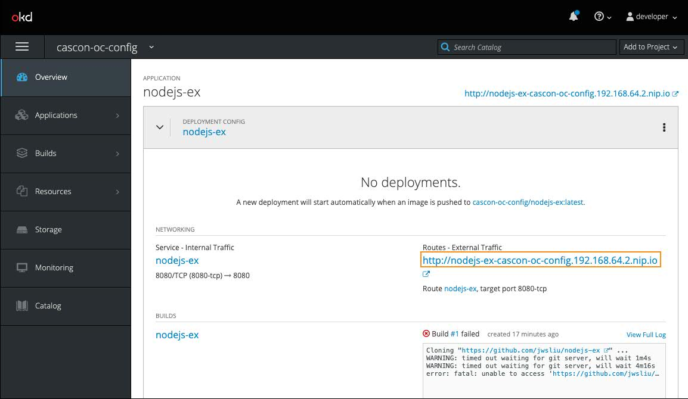

# OpenShift Configuration Lab

## Create a project

1.  Start minishift
    Open a Commandline console

    ```bash
     minishift start
     eval $(minishift oc-env)
    ```

1.  Login into minishift

    ```bash
    oc login
    ```

    enter:

    #### Username: developer

    #### Password: developer

1.  Create a project

    ```bash
    oc new-project cascon-oc-config
    ```

## Create a Mongo DB

1. Open minishift web console

   ```bash
    minishift console
   ```

   A broswer window will open, then login with

   #### Username: developer

   #### Password: developer

1. Click on the project cascon-oc-config from the My Projects list on the right panel
   
1. click on Browse Catalog
   

1. Click on Databases tab and select Mongo and click on MongoDB
   

1. Take all default settings, click on Next and then Create.

1. After creation, click on Show parameter values under Applied Parameter Values
   
1. Examine the parameters under Applied Parameter Values, we will bind the database connection information to a node application later.
   

## Create a Node application

1. Go back to Commandline console, set current project as cascon-oc-config

   ```bash
    oc project cascon-oc-config
   ```

1. Create a new node application under the project from the example github repository
   ```bash
    oc new-app https://github.com/jwsliu/nodejs-ex
   ```
1. Expose the node application
   ```bash
    oc expose svc nodejs-ex
   ```

## Binding environment variables from OpenShift secrets

The node application takes environment variables to confugure the database connection, we want to set these environment variables from OpenShift secrets.

1. Let take a look at the application before we set environment variables. Go to minshift web console, expand nodejs-ex application and click on the url under Route
   
